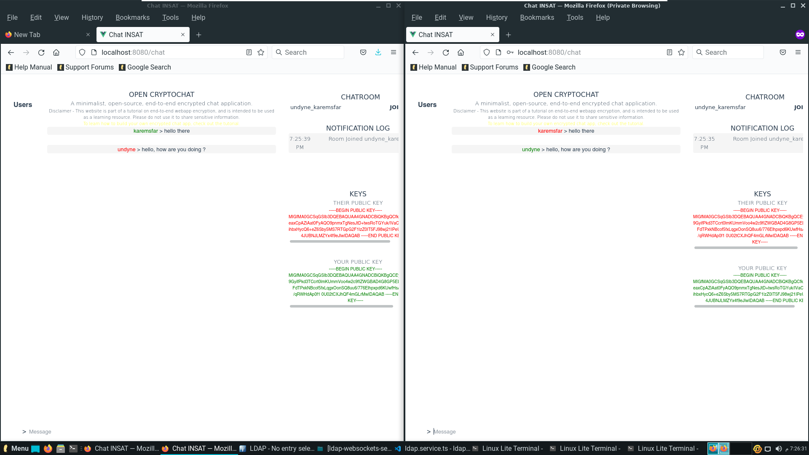
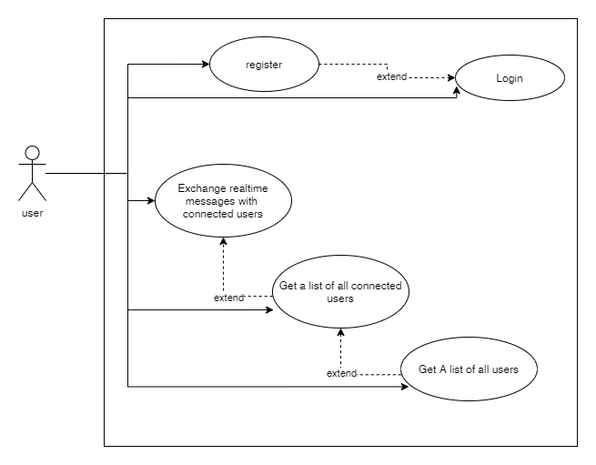
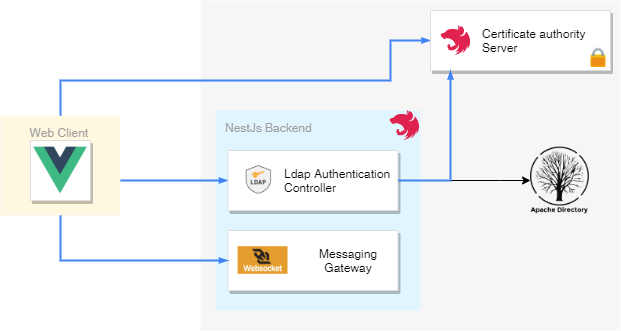
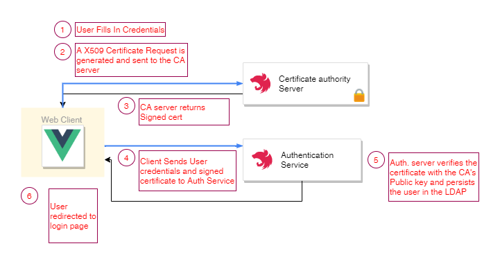
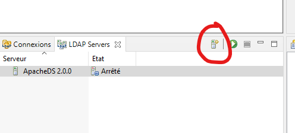
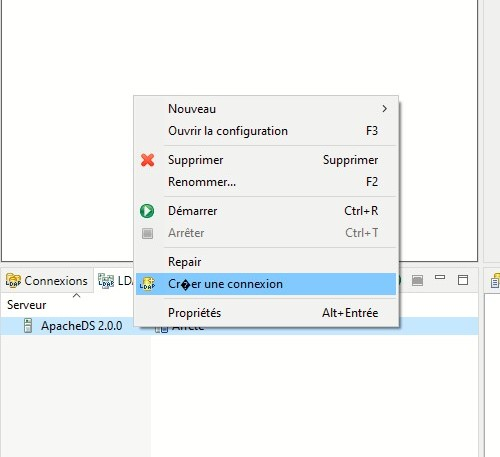

# E2E-Chat
## About
An end-to-end encrypted messaging solution with Lightweight Directory Access Protocol user authentication.

Tools used:
-   NestJS
-   VueJs
-   Apache Directory Studio
-   Node-forge (for generating X509 requests)
<p align="center">
  
</p>


## Use Cases
<p align="center">
  
</p>

## Architecture
<p align="center">
  
</p>

## Register Scenario
<p align="center">
  
</p>

## WebSocket Messages
1) User Logs in, a **JOIN_CHAT** message is sent to the Server.
2) The server sends a **CONNECTED_USERS** with all connected users to clients.
3) Upon room joining, the client sends a **JOIN_ROOM** to the server, each two users have a uniuqe room.
4) Exchanging messages between users happen through a **MESSAGE** event to the server, each message is encrypted with the recipient's public Key, and decrypted with the reciever's private key (stored in local storage).

## Running the solution

- Install NestJs's CLI: (might need admin for some ubuntu distros)
```
    npm install -g @nestjs/cli
```
- Running the certificate authority server:
```
    cd certificate-authority-service
    nest start
```
- Running the LDAP auth / Websockets messaging Server:
```
    1- Download and Install Apache Directory Studio.
    2- Create a new Server (ApacheDS 2.0.0)
```
<p align="center">
  
</p>

```
    3- Add a connection for the server.
```
<p align="center">
  
</p>

```
    4- cd ldap-websockets-service.
    5- nest start
```

- Running the front end app:
```
    npm run serve
```
